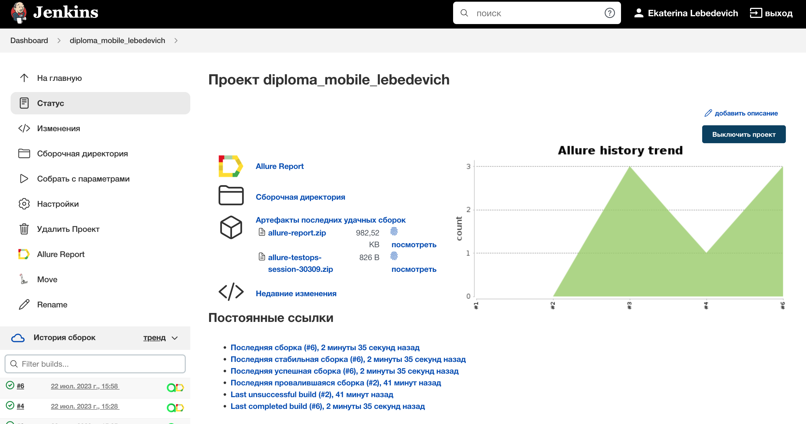
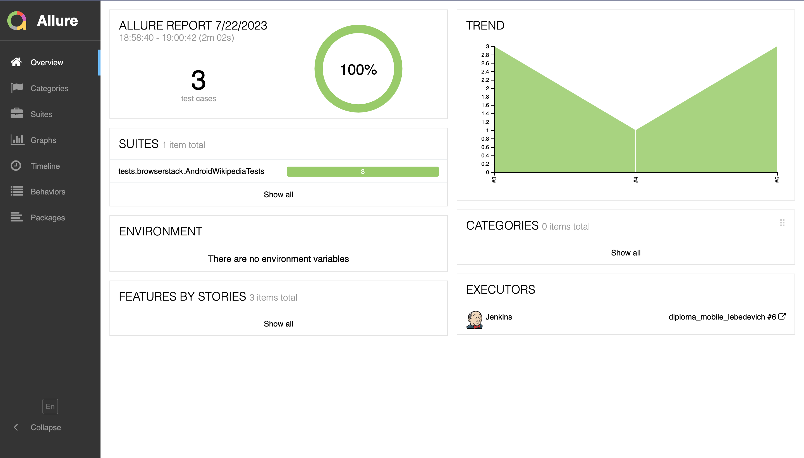
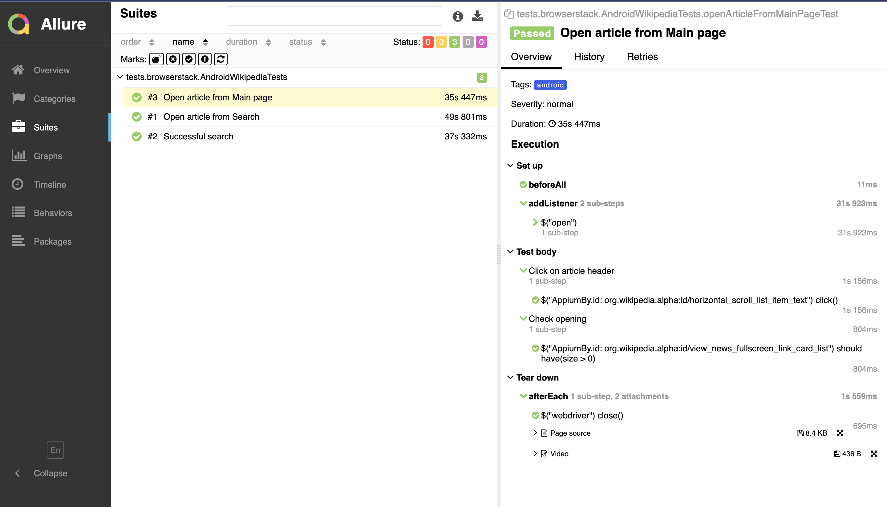
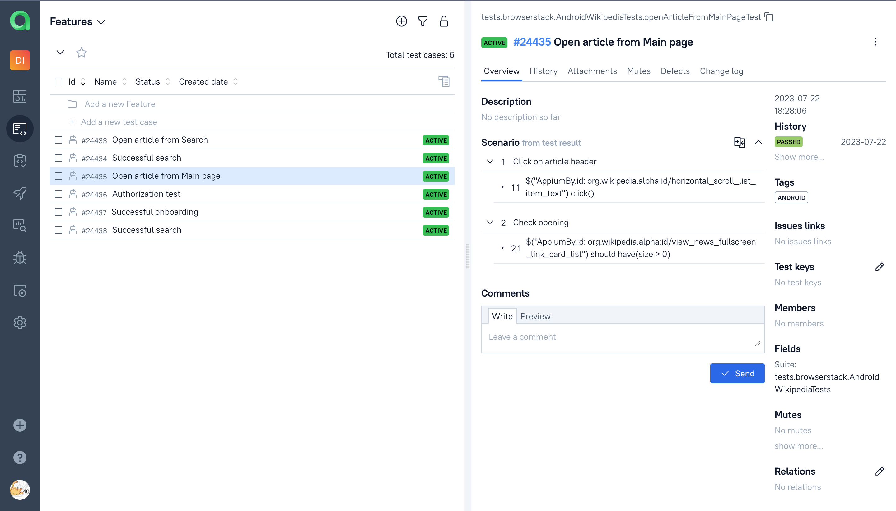
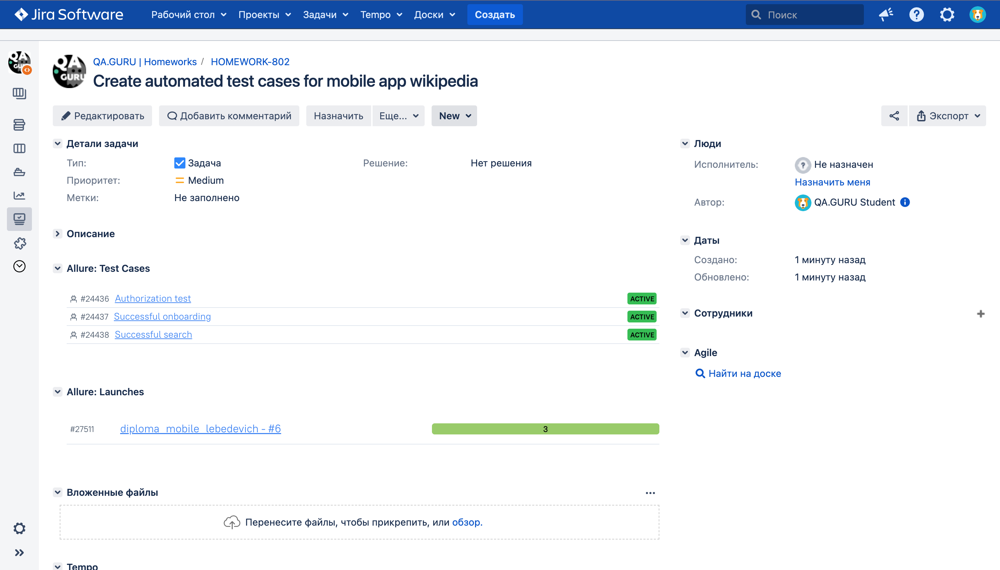
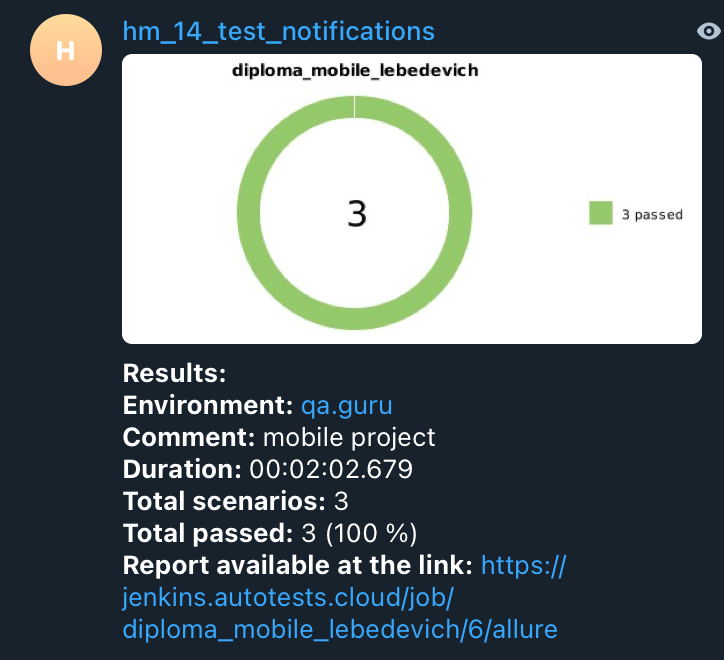
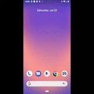

# Automated tests for mobile app [Wikipedia](https://wikipedia.com)

## :pushpin: Content:

- [Stack of technologies](#computer-stack-of-technologies)
- [Running tests](#running_woman-running-tests)
- [Test cases](#page_facing_up-test-cases)
- [Build in Jenkins](#-build-in-jenkins)
- [Allure report](#-allure-report)
- [Allure TestOps Integration](#-allure-testops-integration)
- [Jira Integration](#-jira-integration)
- [Telegram notifications](#-telegram-notifications)
- [Video of an example of running a test in Selenoid](#-video-of-an-example-of-running-a-test-in-selenoid)


## :computer: Stack of technologies

<p align="center">


</p>


## :running_woman: Running tests

#### To run tests locally on an Android emulator:

```
gradle clean android_local -DdeviceHost=emulator
```

#### To run tests in the browserstack on Android:

```
gradle clean android -DdeviceHost=android
```

#### To run tests in the browserstack on iOS:

```
gradle clean ios -DdeviceHost=ios
```


## :page_facing_up: Test cases

#### For Android:
* Successful search
* Open article from Main page
* Open article from Search
#### For iOS:
* Authorization test
#### For Android on emulator:
* Successful onboarding
* Successful search


##  Build in [Jenkins](https://jenkins.autotests.cloud/job/diploma_mobile_lebedevich/)
<p align="center">


</p>


##  [Allure](https://jenkins.autotests.cloud/job/diploma_mobile_lebedevich/allure/) report
### Overview

<p align="center">

</p>

### Test result

<p align="center">

</p>


##  [Allure TestOps](https://allure.autotests.cloud/launch/27511) Integration

<p align="center">

</p>


##  [Jira](https://jira.autotests.cloud/browse/HOMEWORK-802) Integration

And also we can see from <code>Jira</code>, which tests been added to <code>Allure</code> with their statuses

<p align="center">

</p>


##  Telegram notifications

<p align="center">

</p>


##  Video of an example of running a test in Selenoid

A video is attached to each test in the report. One of these videos is shown below.
<p align="center">
  
</p>
